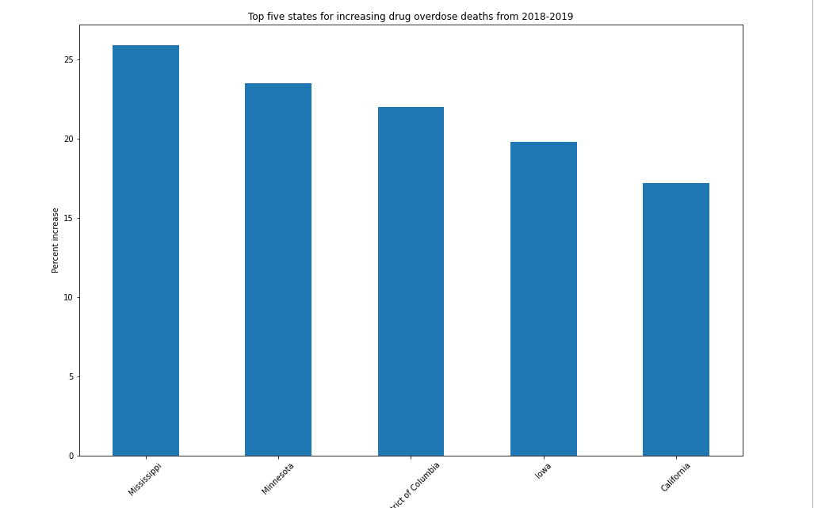
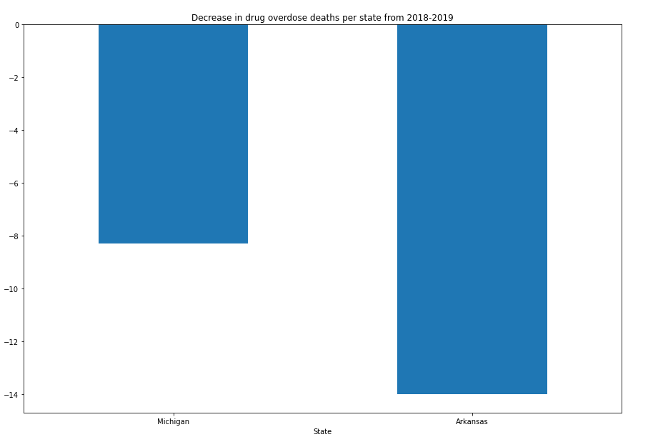

# Data Analysis MVP

### Parts of the Data Analysis MVP

1. Specific question: Are drug overdoses increasing in the U.S. from 2018 to 2019, and which states show an increase or decrease? 
2. Purpose: Determine if drug overdose deaths are an increasing problem.
3. Data sources:
    - https://www.cdc.gov/drugoverdose/deaths/2018.html
    - https://www.cdc.gov/drugoverdose/deaths/2019.html
    - https://www.cdc.gov/drugoverdose/deaths/2018-2019-increase.html
4. Visual elements
    - Bar chart of overdose deaths in 2018
    
    - Bar chart of overdose deaths in 2019
    
    - Scatter plot of changes in overdose deaths (increasing/decreasing/stable) per state from 2018 to 2019 
    
    - Bar chart showing top 5 states for increases in overdose deaths 
    
    - Bar chart showing top 5 states for a decrease in overdose deaths 
    
    - Bar chart showing changes from 2018 to 2019 in overdose deaths in Arizona
    
